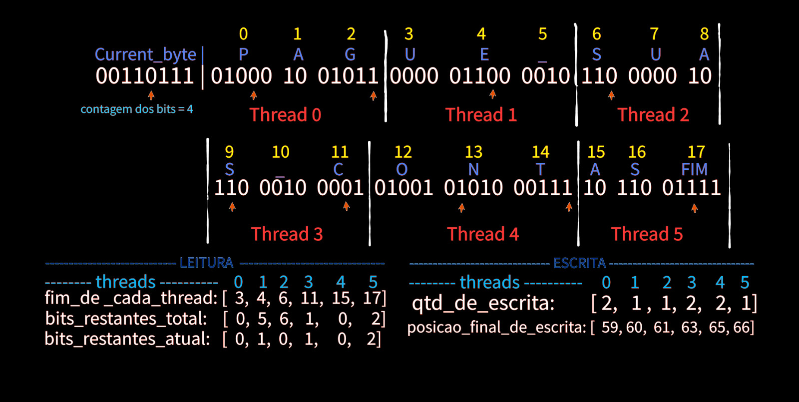

# 🚀 Otimização e Análise Comparativa de Escalabilidade

---

## 🔧 Paralelização do Gargalo

A Figura 2 ilustra a solução adotada para paralelizar o gargalo do código.

Cada índice do vetor representa uma thread, e cada caractere possui um índice.  

Para que uma thread possa buscar bits restantes corretamente, são necessárias três informações:  
- Se a thread anterior deixou bits restantes.  
- Onde ocorreu a última escrita (caractere).  
- Quantos bits sobraram do último caractere escrito.  

Para armazenar essas informações, foram criados os vetores:  
- `bits_restantes_total_`  
- `fim_de_cada_thread`  
- `bits_restante_atual`  

Além disso, para que a thread escreva corretamente no arquivo comprimido, é preciso posicionar o ponteiro de escrita com base em:  
- Quantidade de vezes que a thread anterior escreveu (`qtd_de_escrita`)  
- Posição final da escrita da thread anterior (`posicao_final_de_escrita`)  

Todo esse cálculo foi realizado previamente para viabilizar a paralelização com sucesso.

---

## ⚖️ Paralelizações Testadas

Após a paralelização do gargalo, foi identificado que as funções `fread` e `fwrite` **não são thread-safe**.  
Para proteger essas operações, foram testadas versões usando:  
- `critical`  
- `ordered`  
- `omp_set_lock` / `omp_unset_lock`  

Porém, essas proteções causaram **travamentos** frequentes entre as threads durante as chamadas ao sistema operacional, fazendo com que as operações de leitura e escrita ocorressem de forma sequencial, mesmo com o código paralelizado.  
Devido a esse impacto negativo, todas as versões paralelizadas foram descartadas.

---

## 📦 Buffer

Foi testada a implementação de um **buffer com tamanho fixo** em partes específicas do código do Compressor.  
Esse buffer permite a leitura de blocos maiores de dados de uma só vez, reduzindo chamadas ao sistema operacional e aberturas de arquivo, melhorando a eficiência em comparação com a versão original, no entanto, não conseguimos chegar em uma versão final com o buffer.

De modo geral, o desempenho melhora conforme o tamanho do buffer aumenta, principalmente para arquivos maiores, devido à redução do overhead.

### Resultados dos testes de tempo de execução (em segundos):

| Tamanho do buffer (caracteres) | Tempo de execução (s) |
|-------------------------------|----------------------|
| 1                             | 22,780238            |
| 100                           | 2,334518             |
| 1.000                         | 2,113496             |
| 10.000                        | 2,082477             |
| 1.000.000                     | 1,896297             |

Esses números mostram que buffers pequenos geram muitas chamadas ao sistema, aumentando o tempo, enquanto buffers maiores reduzem esse overhead e aceleram o processamento.

---

## 🎯 Projeto Final

Dado que as paralelizações testadas deterioraram o desempenho e a implementação do buffer não foi concluída, decidiu-se manter a **versão do projeto 2**, com o gargalo serializado e a paralelização para múltiplos arquivos.  

Essa foi a melhor versão testada e foi submetida a testes no NPAD com múltiplos arquivos, visando avaliar a escalabilidade mantendo as paralelizações já implementadas.

---

## 📚 Referências

- GeeksforGeeks. *Huffman Coding | Greedy Algo-3*. Disponível em:  
  [https://www.geeksforgeeks.org/huffman-coding-greedy-algo-3/](https://www.geeksforgeeks.org/huffman-coding-greedy-algo-3/). Acesso em: 08 nov. 2024.

- HENGIRMEN, E. *Huffman Coding*. Disponível em:  
  [https://github.com/e-hengirmen/Huffman-Coding/tree/master](https://github.com/e-hengirmen/Huffman-Coding/tree/master). Acesso em: 29 out. 2024.

- PACHECO, Peter S. *An Introduction to Parallel Programming*. Burlington: Morgan Kaufmann, 2011.
